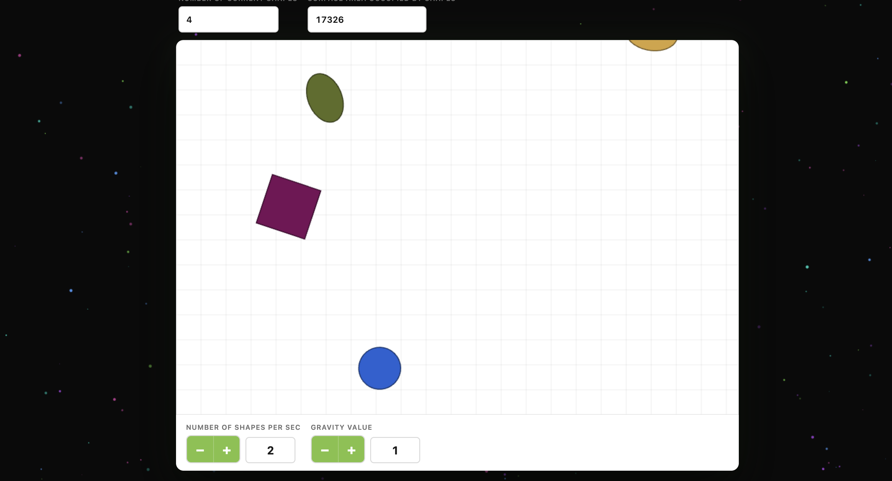

# Pixi Shapes Game

An interactive falling-shapes game built with **PixiJS**, **React**, and **TypeScript**.

## Screenshot



## Features

- Shapes spawn automatically at a configurable rate and fall under configurable gravity
- Click anywhere on the canvas to manually spawn a shape at that position
- Click a shape to recolor all shapes of the same type with a new random color
- Live counters: active shape count and total surface area (px²)
- Seven shape types: Triangle (3), Square (4), Pentagon (5), Hexagon (6), Circle, Ellipse, Random polygon (random n-gon, 3–10 sides)
- Setting gravity to **0** freezes all visible shapes in place and pauses auto-spawning

## Tech Stack

| Layer | Technology |
|---|---|
| Graphics | PixiJS 8 (WebGL) |
| UI / App shell | React 19 + TypeScript |
| Styling | Tailwind CSS 4 |
| Build | Vite 7 |
| Package manager | npm |

## Architecture

```
src/game/
├── models/
│   ├── Shape.ts          — Abstract Shape base + 7 concrete types (incl. RandomPolygonShape)
│   ├── ShapeFactory.ts   — Creates random Shape instances
│   └── GameState.ts      — Active shapes, gravity, spawn rate, statistics
├── views/
│   ├── GameView.ts       — PixiJS canvas renderer
│   └── UIView.ts         — HTML controls and stat fields
├── services/
│   └── GameService.ts    — Pure functions: spawn, hit-test, sync UI
└── controllers/
    └── GameController.ts — createGame() factory: game loop + wiring
```

- **Models** hold state only — no DOM, no rendering.
- **Views** render only — no business logic.
- **Services** contain pure functions shared between the loop and input handling.
- **`createGame()`** owns the `requestAnimationFrame` loop and wires everything together.

## Build & Run

### Prerequisites

- Node.js 18 or later
- npm 10 or later

### Development

```bash
npm install
npm run dev
```

Opens at `http://localhost:3000` with hot-module replacement.

### Production build

```bash
npm run build
```

Static output is written to `dist/`. Deploy that folder to any static host (Netlify, Vercel, GitHub Pages, etc.).

### Preview production build locally

```bash
npm run preview
```

### Type check

```bash
npm run check
```

## How to Play

| Action | Effect |
|---|---|
| Click canvas background | Spawns a random shape at the cursor |
| Click a shape | Recolors all shapes of the same type with a random color |
| **−** / **+** next to *Number of shapes per sec* | Adjusts auto-spawn rate (1 – 20) |
| **−** / **+** next to *Gravity Value* | Adjusts gravity (0 – 10); 0 freezes everything |

## License

MIT
# PIXI-SHAPES
